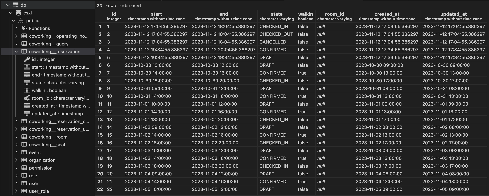

# Technical Specification Documentation

## Story 1

### 1. New model representation(s) and API routes

In this story, we created a new functionality called "Statistics", with corresponding api route "/statistics/get-daily". Which looks like the image below.

Our statistic function takes in the start date and end date, and return a plotted graph of all the reservation counts for each day. For better visualization, a line pass through the points to better show the change in daily reservation changes.
The data is fetched directly from our given database and calculated for the frontend display.
Sample data: our testing data in the local database is attached below.

### 2. Description of underlying database/entity-level representation decisions

We implemented our feature by extending on the given reservation data. We decided not to create a new table for Story1 because the timeframe for one single graph is short, making it unnecessary to add to a new table. We calculated the number of data of each day during the period and directly plot to the graph.

However, for story2, we would let user decide which report are expected as common viewed, so the user can click save and we would then store it to the database called query.

### 3. Technical and user experience design choice

Technical choice: we decided between creating a new service method and extending on the given registration method. We chose to implement the exsisting registration service because after code review, we realized that many given helper function in the registration service are useful for our new functionality. Therefore we decided to add a new method to the registration service.

Design choice: When considering the display of the statistics, we debated between using a line chart or showing with bar plot. We conclude to use line plot for easier visualization, and making it more straight forward when coming to comparson between the two different timestamps.

We made another choice on where to put the link to the statistics page. We had two options of either putting it on the side bar or displaying it under ambassador reservation history page. We dacided to go with the second one, in order to prevent from users with other authority being able to view the data. And also making the side bar clean.

### 4. Development concern

Our feature basically takes two time frames: the start date and end date, and plot the number of reservations each day to the line graph to get a visualization of how the data among the period is like. People can choose to add a comparson timeframe to generate another line graph of different color. The algorithm is straight forward, with taking the timeframe and break down into each day. For every day, we count the number of reservations and store into a dictionary. Then, we plot the data in the dictionary to the graph.

One major concern is for people to understand about the angular material package. We used the datepicker from this to be able to analyze the date and plot to the chart. Moreover, we imported displaying chart functionality from chart.js to pass in the plotted values and set the display chart to true to turn on the visual.
